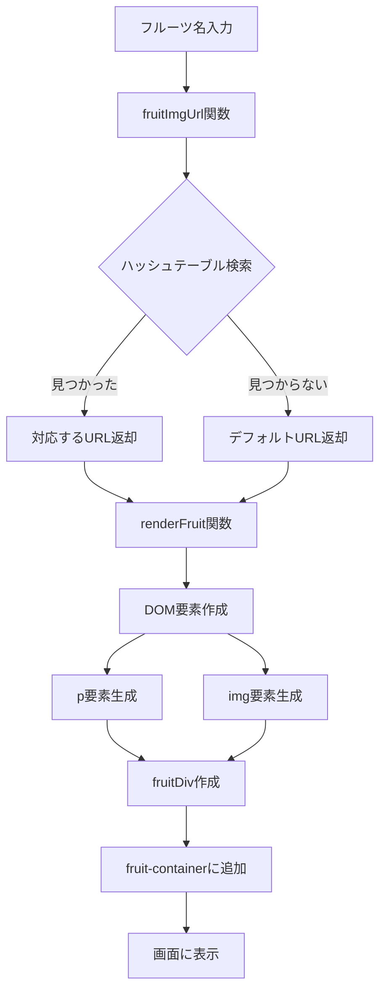

# フルーツ画像レンダリングプロジェクト

## 概要
フルーツの名前を指定して、対応する画像をWebページ上に動的に表示するシンプルなWebアプリケーションです。JavaScript、HTML、CSSの基本的な技術を使用して、DOM操作と動的コンテンツ生成を学習することを目的としています。

## 特徴
- 純粋なJavaScript（Vanilla JS）で実装されたフロントエンドアプリケーション
- ハッシュテーブルを使用した効率的なデータ管理
- レスポンシブデザインに対応したBootstrap CSSフレームワークの活用
- 動的なDOM要素の生成と操作
- 存在しないフルーツに対するフォールバック機能

## このプロジェクトを通して学べること・習得できること

### フロントエンド開発の基礎
- **DOM操作の実践**: `document.createElement()`、`appendChild()`、`classList.add()`などのDOM APIの使用方法
- **イベント駆動プログラミング**: ユーザー操作に応じた動的なコンテンツ更新の理解
- **CSS Flexboxレイアウト**: モダンなレスポンシブデザインの実装技術

### JavaScript プログラミング技術
- **データ構造の選択と最適化**: switch文からハッシュテーブルへの改善による計算量の削減（O(n)からO(1)へ）
- **関数型プログラミングの基礎**: 純粋関数の設計と再利用可能なコンポーネントの作成
- **条件分岐とエラーハンドリング**: 三項演算子を使用した簡潔なコード記述
- **ES6+の機能**: constキーワード、テンプレートリテラル、アロー関数の実践的使用

### ソフトウェア設計パターン
- **関心の分離（Separation of Concerns）**: データ取得、UI生成、レンダリングロジックの明確な分離
- **単一責任の原則**: 各関数が一つの明確な責任を持つ設計
- **設定駆動開発**: ハッシュテーブルによる設定ベースのURL管理

### Webアーキテクチャの理解
- **MVC（Model-View-Controller）パターンの基礎**: データ（Model）、表示（View）、制御（Controller）の役割分担
- **外部リソースの統合**: CDNからのライブラリ読み込みとWebリソースの管理



## 必要条件
- モダンなWebブラウザ（Chrome、Firefox、Safari、Edge）
- インターネット接続（Bootstrap CSS、Font Awesome、外部画像リソースの読み込みのため）

## インストール手順
1. プロジェクトをクローンまたはダウンロード
```bash
git clone [repository-url]
cd fruitRendering
```

2. Webサーバーで起動（推奨）
```bash
# Python 3の場合
python -m http.server 8000

# Node.jsのhttpサーバーの場合
npx http-server
```

3. ブラウザで `http://localhost:8000/fruitRendering.html` にアクセス

## 使用方法
1. Webブラウザで[fruitRendering.html](fruitRendering.html)を開く
2. ページが自動的に5種類のフルーツ（banana、pear、pineapple、coconut、grape）を表示
3. 各フルーツには名前と対応する画像が表示される
4. 未定義のフルーツ（coconut、grape）にはデフォルト画像が表示される

## 機能一覧
- フルーツ名からURL取得機能（[`fruitImgUrl`](fruitImgUrl.js)関数）
- 動的なHTML要素生成機能（[`renderFruit`](fruitImgUrl.js)関数）
- レスポンシブデザイン対応
- 複数フルーツの同時表示
- フォールバック画像表示機能

## 技術スタック
- **HTML5**: セマンティックマークアップ
- **CSS3**: Flexboxレイアウト、カスタムスタイリング
- **JavaScript (ES6+)**: Vanilla JS、DOM操作
- **Bootstrap 4.1.3**: CSSフレームワーク
- **Font Awesome 6.1.2**: アイコンライブラリ

## ファイル構成
- [`fruitRendering.html`](fruitRendering.html): メインのHTMLファイル
- [`fruitImgUrl.js`](fruitImgUrl.js): JavaScript実装ファイル
- [`fruitRendering.css`](fruitRendering.css): カスタムスタイルシート

## 追加資料
プロジェクトの詳細な設計については、コード内のコメントを参照してください。特に[`fruitImgUrl.js`](fruitImgUrl.js)では、switch文からハッシュテーブルへの改善例が実装されています。

## 貢献方法
1. このリポジトリをフォーク
2. 新しい機能ブランチを作成 (`git checkout -b feature/new-fruit`)
3. 変更をコミット (`git commit -am 'Add new fruit: apple'`)
4. ブランチにプッシュ (`git push origin feature/new-fruit`)
5. Pull Requestを作成

### 貢献アイデア
- 新しいフルーツの追加
- アニメーション効果の実装
- フルーツ情報の詳細表示機能
- 検索・フィルタリング機能

## ライセンス
MIT License

このプロジェクトはMITライセンスの下で公開されています。詳細については、LICENSEファイルを参照